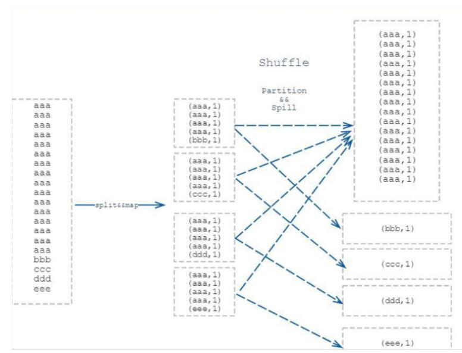

# 1. 什么是数据倾斜

数据倾斜就是由于数据分布不均匀，数据大量集中到一节点上。

# 2. 数据倾斜产生的原因

## 2.1 map 端数据倾斜

* 数据分布不合理，调整副本数量。
* block 大小设置不合理

```
dfs.blocksize = 134217728 #128M
```
* 行数多和行数少的分片设置

## 2.2 reduce 端数据倾斜

### 2.2.1 partition 引起的数据倾斜 (shuffle阶段)

shuffle 时数据量大的 key 被分配到同一个 partition 里，传递给 reduce 的数据量太大，照成这个 reduce 处理时间太长。



`解决方案：`

* 增加 reduce 数量，即增加的 partiton 数量，减少 partition 的大小
* 使用 combiner, 在 map 端聚合

### 2.2.2 JOIN
* 先过滤再 JOIN，而不要先 JOIN 后过滤

#### 2.2.2.1. map join

### 2.2.2.2. reduce join
* 分桶：reduce 端 join 转成 map 端 join
* 空值
 - 不参与关联
 - 赋予新的 key 值

### 2.3  GROUP BY / DISTINCT
* map 端聚合

# 3. 处理方案
* 增加内存
* [x] 增加 reduce 的个数
* 自定义分区
* [x] 使用 combiner，即在 map 端进行聚合 (hive.map.aggr=true 默认值: true)
* 空值
